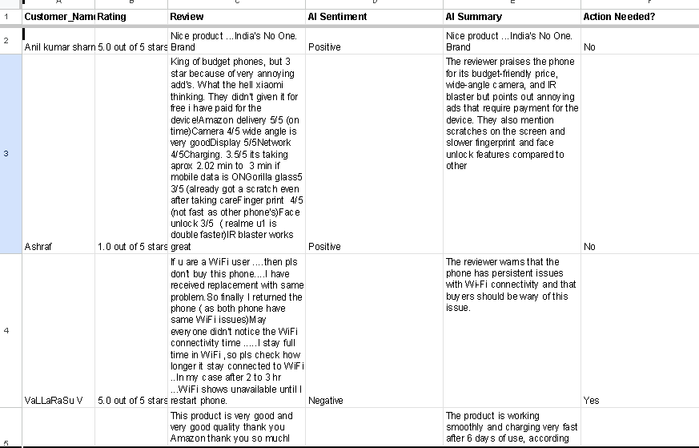
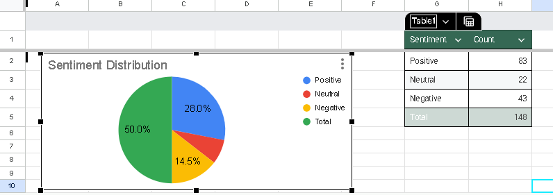

# team-O-automation

# Automate Review Analysis – Team O

This project automates the analysis of **Redmi 6 user reviews** using Python, Cohere AI, and the Google Sheets API. It extracts raw review data from a spreadsheet, analyzes sentiment, generates summaries, and visualizes the results — all in one seamless workflow.

---

## Features

- **Fetch Reviews**: Pulls raw reviews from Google Sheets.
- **AI Sentiment Analysis**: Uses Cohere API to classify sentiments (Positive, Neutral, Negative).
- **Smart Summarization**: Generates concise summaries of each review.
- **Action Flags**: Flags reviews needing attention.
- **Automated Charting**: Creates a pie chart for sentiment distribution in a separate sheet.
- **Live Sheet Update**: Updates the original Google Sheet with new data.
- **Visual Enhancements**: Color-coded rows for sentiment clarity.

---

## Tech Stack

- **Python 3.10+**
- **Cohere API**
- **GSpread** – Python Google Sheets client
- **Google Sheets API v4**
- **Matplotlib** *(for chart generation)*
- **dotenv** – for environment variable management

---

## Project Structure

```bash
team-O-automation/
│
├── assets/                     
│   ├── AI_Summary,Sentiment,Action Table.png   # Screenshot of updated table
│   └── Pie Chart.png                           # Screenshot of sentiment pie chart
│
├── credentials/               
│   └── gspread_creds.json                       # Google Sheets credentials
│
├── data/                                        # (Optional) for raw datasets
│
├── src/                                        
│   ├── analyze_reviews.py                       # Main review analysis script
│   └── create_sentiment_chart.py                # Script to create pie chart
│
├── .env                                         # Environment variables (not committed)
├── .gitignore                                   # Ignore venv, creds, etc.
├── requirements.txt                             # Python dependencies
└── README.md
```

---

## Setup Instructions

### 1. Clone the repo

```bash
git clone https://github.com/yourusername/team-O-automation.git
cd team-O-automation
```

### 2. Create and activate a virtual environment

```bash
source venv/bin/activate           
```

### 3. Install the dependencies

```bash
pip install -r requirements.txt
```

### 4. Set up environment variables

Create a `.env` file in the root directory and add:

```env
COHERE_API_KEY=your_cohere_api_key
```

### 5. Add Google Sheets credentials

Save your Google service account credentials JSON file as:

```bash
credentials/gspread_creds.json
```

---

## How to Run

### 1. Analyze Reviews and Update Google Sheet

```bash
python src/analyze_reviews.py
```

### 2. Create Sentiment Pie Chart in a New Sheet

```bash
python src/create_sentiment_chart.py
```

---

## Sample Output

### Google Sheet: AI Sentiment, Summary, and Action Flag



### Google Sheet: Sentiment Pie Chart



---

## Credits

- Developed by **Team O**
- Sentiment analysis powered by **Cohere AI**
- Data automation via **Google Sheets API** and **GSpread**

---

## License

This project is for educational/demo purposes only. Not licensed for commercial redistribution.
